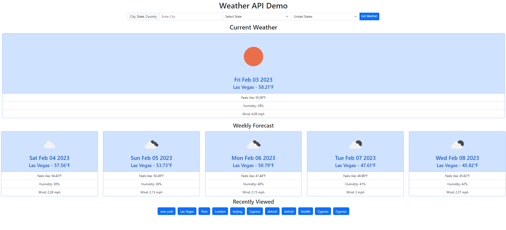

# Week-Six-Challenge
Weather Dashboard Challenge

## Project Description
For this project the intent was to create a funcitonin weather dashboard that displays the Current weather conditions for a selected city as well as weather conditions for the upcoming 5 days. The purpose was to demonstrate knowledge  calling a 3rd party API (openWeatherMap) to get weather conditions from a user input. For my application the user is able to input a desired City and country (and can add State if relevant) to bring up the desired results. The city/state/country-code is translated into latitude/longitude cooridantes which we then use to call the API. It was also designed to store search history to local data in order to easily recall weather for City that was viewed before.

## Resources
The list of country codes for the select element was obtained here: https://www.freeformatter.com/iso-country-list-html-select.html

## Deployed Application
